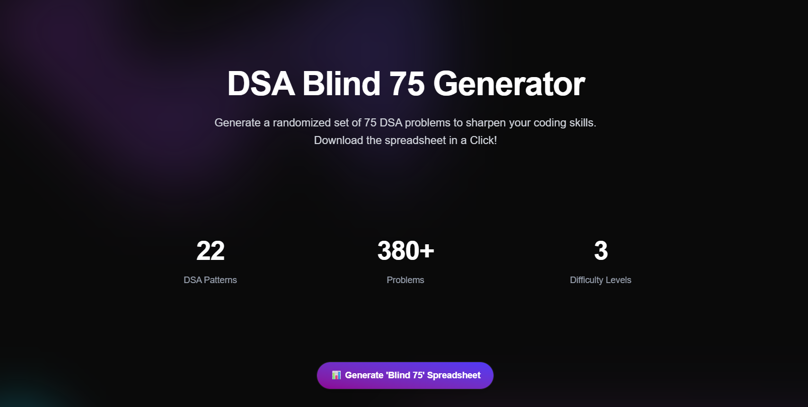

# 🧠 Blind 75 Generator

A sleek, responsive React + Vite web app that generates a randomized set of 75 DSA problems based on categorized patterns. Export the list instantly as an Excel spreadsheet for focused practice.

## 🗿 Guide

All pattern based problems: [here](public/dsa-patterns.md)

## 🛠️ Tech Stack

- [React](https://reactjs.org/)
- [Vite](https://vitejs.dev/)
- [Tailwind CSS](https://tailwindcss.com/)
- [xlsx.js](https://github.com/SheetJS/sheetjs) for file export

## 📸 Preview

[Live Link](https://algo-blind75-generator.vercel.app/)

## 🙋🏼‍♂️ Contact

If you have any questions or suggestions related to this project, you can reach out to me at:

- GitHub: [arindal1](https://github.com/arindal1)
- LinkedIn: [arindalchar](https://www.linkedin.com/arindalchar/)
- Twitter: [arindal_17](https://twitter.com/arindal_17)

---